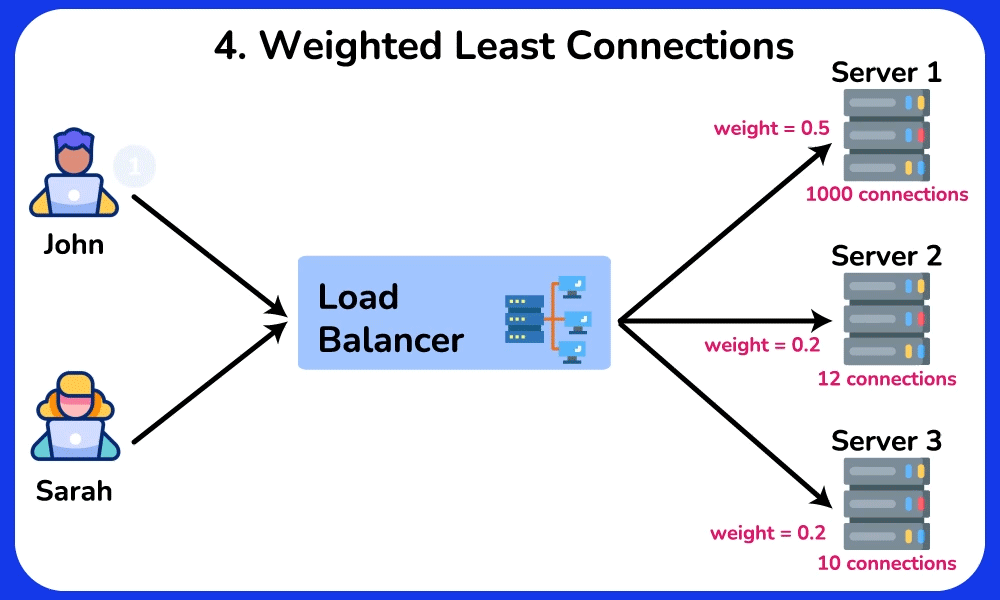

# Core Networking and Infrastructure Concepts

## 1. IP Addresses (Internet Protocol)

An IP address is a unique identifier that allows devices to communicate on the internet or local networks. It's like a postal address for digital devices.

### `IP Versions`

**IPv4 (32-bit)**
- Format: Four decimal numbers separated by dots
- Address space: ~4 billion addresses
- Example: `192.168.1.1` or `8.8.8.8` (Google DNS)
- Status: Nearly exhausted due to internet growth

**IPv6 (128-bit)**
- Format: Eight groups of hexadecimal numbers separated by colons
- Address space: ~340 undecillion addresses (340 × 10³⁶)
- Example: `2001:0db8:85a3:0000:0000:8a2e:0370:7334`
- Simplified: `2001:db8:85a3::8a2e:370:7334` (zeros can be omitted)

### `IP Address Types`

| Type | Description | Example Use Case |
|------|-------------|------------------|
| **Public** | Globally routable, assigned by ISP | Your home router's external IP |
| **Private** | Local network only, not internet-routable | Devices in your home (192.168.x.x) |
| **Static** | Never changes, manually configured | Web servers, email servers |
| **Dynamic** | Changes periodically, assigned by DHCP | Most home internet connections |

**Private IP Ranges:**
- `10.0.0.0` - `10.255.255.255`
- `172.16.0.0` - `172.31.255.255`
- `192.168.0.0` - `192.168.255.255`

---

## 2. OSI Model (Open Systems Interconnection)

The OSI model is a 7-layer framework that standardizes how network communication works. Think of it as a universal language for networking.

### `The Seven Layers`

| Layer | Name | Function | Examples |
|-------|------|----------|----------|
| **7** | Application | User interface, network services | HTTP, SMTP, FTP, web browsers |
| **6** | Presentation | Data translation, encryption, compression | SSL/TLS, JPEG, MP3 |
| **5** | Session | Establishes, manages, terminates connections | NetBIOS, RPC, SQL sessions |
| **4** | Transport | End-to-end data delivery, error recovery | TCP, UDP |
| **3** | Network | Routing between different networks | IP, ICMP, routers |
| **2** | Data Link | Node-to-node delivery on same network | Ethernet, Wi-Fi, switches |
| **1** | Physical | Electrical signals, cables, hardware | Cables, hubs, repeaters |

### `Why OSI Matters`

- **Troubleshooting**: Isolate problems to specific layers
- **Standardization**: Ensures different vendors' equipment works together
- **Security**: Understand where threats can occur at each layer
- **Education**: Breaks complex networking into manageable concepts

**Real-world Example**: When you visit a website:
1. **Physical**: Electrical signals travel through cables
2. **Data Link**: Your network card handles local network communication
3. **Network**: Your router finds the path to the web server
4. **Transport**: TCP ensures all data arrives correctly
5. **Session**: Your browser maintains a session with the server
6. **Presentation**: HTTPS encrypts the data
7. **Application**: Your browser displays the webpage

### `TCP vs UDP (Transport Protocols)`

- TCP (Transmission Control Protocol)
    - **Connection-oriented**: Establishes a connection before sending data
    - **Reliable**: Guarantees data delivery and correct order
    - **Error checking**: Retransmits lost packets
    - **Slower**: Due to overhead from reliability features

    **Use Cases**: Web browsing (HTTP/HTTPS), email (SMTP), file transfer (FTP)

- UDP (User Datagram Protocol)
    - **Connectionless**: Sends data without establishing a connection
    - **Fast**: Minimal overhead
    - **No guarantees**: No delivery confirmation or error correction
    - **Fire-and-forget**: Sends data whether receiver is ready or not
    
    **Use Cases**: Live video streaming, online gaming, DNS queries, VoIP calls
    
### TCP vs UDP Comparison

| Feature | TCP | UDP |
|---------|-----|-----|
| **Speed** | Slower (reliable) | Faster (minimal overhead) |
| **Reliability** | Guaranteed delivery | No guarantees |
| **Connection** | Connection-oriented | Connectionless |
| **Data Order** | Maintains order | No order guarantee |
| **Error Handling** | Built-in error correction | Basic error detection only |
| **Use When** | Accuracy is critical | Speed is more important than accuracy |

**Analogy**: 
- **TCP** is like registered mail - slower but guaranteed delivery
- **UDP** is like shouting across a room - fast but no guarantee everyone heard

---

## 3. Domain Name System (DNS)

DNS translates human-readable domain names (like `google.com`) into IP addresses that computers use. It's like the internet's phonebook.

### `How DNS Works`

### `DNS Server Types`

**DNS Resolver (Recursive Resolver)**
- First stop for DNS queries
- Acts as middleman between client and nameservers
- Caches responses for faster future lookups
- Example: Your ISP's DNS server (8.8.8.8 for Google)

**Root Nameservers**
- 13 types worldwide (A through M)
- Direct queries to appropriate TLD servers
- Managed by ICANN

**TLD Nameservers**
- Handle specific extensions (.com, .org, .net)
- Two types: Generic (gTLD) and Country Code (ccTLD)
- Examples: `.com`, `.uk`, `.edu`, `.gov`

**Authoritative Nameservers**
- Final authority for specific domains
- Contains actual DNS records
- Returns IP addresses or CNAME records

### `DNS Query Types`

| Query Type | Description | When Used |
|------------|-------------|-----------|
| **Recursive** | Resolver does all the work, returns final answer | Most client queries |
| **Iterative** | Client follows referrals to find answer | Between DNS servers |
| **Non-recursive** | Answer already known/cached | Cached responses |

### `Common DNS Record Types`

| Record | Purpose | Example |
|--------|---------|---------|
| **A** | Maps domain to IPv4 address | `google.com → 172.217.164.142` |
| **AAAA** | Maps domain to IPv6 address | `google.com → 2607:f8b0:4004:c1b::65` |
| **CNAME** | Alias to another domain | `www.example.com → example.com` |
| **MX** | Mail server for domain | `example.com → mail.example.com` |
| **TXT** | Text information | SPF, DKIM for email security |
| **NS** | Nameserver for domain | `example.com → ns1.example.com` |

### `DNS Concepts`

**Subdomains**
- Additional parts of main domain
- Examples: `blog.example.com`, `mail.example.com`, `api.example.com`
- Used for organizing services and content

**DNS Zones**
- Administrative divisions of domain namespace
- Allow granular control over DNS records
- Can delegate authority to different entities

**DNS Caching & TTL**
- **TTL (Time To Live)**: How long records can be cached
- **Caching**: Improves performance by storing recent lookups
- When TTL expires, new lookup required

**Reverse DNS**
- Maps IP addresses back to domain names
- Uses PTR records
- Important for email servers to verify legitimacy

### `Popular DNS Providers`

- **Cloud Providers**: AWS Route53, Google Cloud DNS, Azure DNS
- **CDN/Security**: Cloudflare DNS (1.1.1.1)
- **Public DNS**: Google (8.8.8.8), Quad9 (9.9.9.9)
- **Specialized**: NS1 for advanced DNS management

---

## 4. Load Balancer

Load balancing is a crucial component of system design that distributes workloads evenly across multiple computing resources to optimize resource utilization, minimize response time, and maximize throughput. A load balancer acts as an intermediary that sits between clients and servers, accepting incoming network and application traffic and distributing it across multiple backend servers using various algorithms.

### `Key Terminology and Concepts`

- **Load Balancer**: A device or software that distributes network traffic across multiple servers based on predefined rules or algorithms
- **Backend Servers**: The servers that receive and process requests forwarded by the load balancer (also called server pool or server farm)
- **Load Balancing Algorithm**: The method used to determine how to distribute incoming traffic among backend servers
- **Health Checks**: Periodic tests to determine availability and performance of backend servers
- **Session Persistence**: Technique ensuring subsequent requests from the same client go to the same backend server
- **SSL/TLS Termination**: Process of decrypting SSL/TLS traffic at the load balancer level

### `How Load Balancers Work`

1. Load balancer receives a request from a client
2. Evaluates the request and determines which server should handle it based on the configured algorithm
3. Forwards the traffic to the selected server
4. Server processes the request and sends response back to load balancer
5. Load balancer receives response and sends it to the original client

### `Strategic Placement`

Load balancers can be deployed at three key layers:
- Between users and web servers
- Between web servers and internal platform layer (application servers/cache servers)
- Between internal platform layer and database

### `Uses of Load Balancing`

- **Performance Improvement**
Distributes incoming web traffic among multiple servers, reducing individual server load and ensuring faster response times. This is particularly valuable during traffic spikes like holiday sales or viral content.

- **High Availability and Reliability**
Prevents single points of failure by redirecting traffic to healthy servers when others fail or experience issues. Critical for maintaining uptime in mission-critical applications.

- **Scalability**
Enables easy infrastructure scaling by adding servers to the load balancing pool without significant infrastructure changes. Organizations can grow seamlessly as demand increases.

- **Redundancy**
Maintains multiple copies of data and services across servers, reducing risk of data loss or service outages due to hardware failures.

- **Network Optimization**
Distributes traffic across multiple network paths or links, reducing congestion and improving overall network performance.

- **Geographic Distribution**
Directs users to nearest or best-performing data centers based on location, reducing latency and improving user experience for global applications.

- **Application Performance**
Assigns dedicated resources to specific applications or services, ensuring optimal performance without interference between different services.

- **Security Benefits**
Helps protect against DDoS attacks by distributing malicious traffic across multiple servers, making it harder for attackers to overwhelm a single target.

- **Cost Optimization**
Improves resource efficiency, potentially reducing hardware and infrastructure costs while minimizing energy consumption.

- **Content Caching**
Some load balancers cache static content like images and videos, serving them directly and reducing server demand while improving response times.

### `Load Balancer Types`

- **Hardware Load Balancing**
  
    Physical devices using specialized components (ASICs or FPGAs) for high-performance traffic distribution.
    
    **Pros**: High performance, built-in security features, handles large traffic volumes
    
    **Cons**: Expensive, requires specialized knowledge, limited scalability
    
    **Use Case**: Large enterprises with high-traffic requirements

- **Software Load Balancing**
  
    Applications running on general-purpose servers or virtual machines using software algorithms for traffic distribution.
    
    **Pros**: More affordable, easily scalable, flexible deployment options
    
    **Cons**: Lower performance under heavy loads, consumes host resources, requires maintenance
    
    **Use Case**: Startups and growing businesses with cloud infrastructure
    
- **Cloud-based Load Balancing**
  
    Services provided by cloud providers as part of their infrastructure offerings.
    
    **Pros**: Highly scalable, simplified management, pay-as-you-use pricing
    
    **Cons**: Vendor dependency, less control over configuration, potential vendor lock-in
    
    **Use Case**: Applications built on cloud platforms

- **DNS Load Balancing**
  
    Uses DNS infrastructure to resolve domain names to multiple IP addresses, distributing traffic at the DNS level.
    
    **Pros**: Simple implementation, geographic distribution capability
    
    **Cons**: Slow DNS updates, no server health consideration, limited session persistence
    
    **Use Case**: Content delivery networks and geographic distribution

- **Global Server Load Balancing (GSLB)**
  
    Distributes traffic across geographically dispersed data centers with advanced features like health checks and custom routing.
    
    **Pros**: Multi-datacenter failover, improved global performance, advanced routing features
    
    **Cons**: Complex setup, may require specialized hardware, DNS limitations
    
    **Use Case**: Multinational corporations with global infrastructure

- **Hybrid Load Balancing**
  
    Combines multiple load balancing techniques for optimal performance, scalability, and reliability.
    
    **Pros**: High flexibility, leverages strengths of different techniques, adaptable strategy
    
    **Cons**: Complex management, requires expertise in multiple techniques, higher costs
    
    **Use Case**: Large-scale platforms requiring comprehensive load balancing solutions

- **Layer 4 Load Balancing**

    Operates at the transport layer using TCP/UDP header information like IP addresses and port numbers.
    
    **Pros**: Fast and efficient, handles various protocols, simple implementation
    
    **Cons**: No application-level awareness, limited session persistence
    
    **Use Case**: Gaming platforms and protocol-agnostic applications
    
- **Layer 7 Load Balancing**

    Operates at the application layer using HTTP headers, cookies, and URL paths for intelligent routing decisions.
    
    **Pros**: Application-aware routing, supports advanced features, fine-grained control
    
    **Cons**: Higher resource consumption, more complex setup, slower than Layer 4
    
    **Use Case**: Web applications with microservices requiring content-based routing

### `Load Balancing Algorithms`

- **Round Robin**
  
    Distributes requests in cyclic order, moving sequentially through servers and returning to the first after reaching the last.
    
    **Pros**: Equal distribution, easy implementation, works well with similar server capacities
    
    **Cons**: No load awareness, no session affinity, poor performance with different capacities
    
    **Use Case**: Homogeneous environments with stateless applications

  

- **Least Connections**
  
    Assigns requests to the server with the fewest active connections at request time.
    
    **Pros**: Load awareness, dynamic distribution, efficient for heterogeneous environments
    
    **Cons**: Higher complexity, requires state maintenance, potential connection spikes
    
    **Use Case**: Variable traffic patterns and stateful applications

  

- **Weighted Round Robin**

    Enhanced Round Robin that assigns weights based on server capacity, distributing requests proportionally.
    
    **Pros**: Capacity-based distribution, flexible weight adjustment, improved performance
    
    **Cons**: Complex weight assignment, increased overhead, not ideal for variable loads
    
    **Use Case**: Heterogeneous server environments with known capacity differences
  
  

- **Weighted Least Connections**

    Combines Least Connections with server weights, considering both active connections and server capacity.
    
    **Pros**: Dynamic and capacity-aware, handles heterogeneous environments, flexible
    
    **Cons**: High complexity, requires state and weight maintenance, challenging weight assignment
    
    **Use Case**: High-traffic applications with servers of varying capacities
  
  

- **IP Hash**

    Routes requests based on client IP address hash, ensuring consistent server assignment for the same client.
    
    **Pros**: Session persistence, simple implementation, deterministic routing
    
    **Cons**: Uneven distribution, disrupted by server changes, limited flexibility
    
    **Use Case**: Stateful applications requiring session persistence
  
  
        
- **Least Response Time**

    Assigns requests to the server with the lowest response time based on recent performance metrics.
    
    **Pros**: Optimized performance, dynamic adjustment, effective resource utilization
    
    **Cons**: Implementation complexity, monitoring overhead, short-term variability issues
    
    **Use Case**: Real-time applications requiring low latency
  
  

- **Random**
      
    Selects servers randomly for each request without considering server state or performance.
    
    **Pros**: Simple implementation, no state maintenance, uniform long-term distribution
    
    **Cons**: No load awareness, potential short-term imbalance, no session affinity
    
    **Use Case**: Simple deployments with homogeneous servers
  
  

- **Least Bandwidth**

    Routes requests to the server consuming the least bandwidth at request time.
    
    **Pros**: Dynamic bandwidth balancing, prevents overloading, efficient resource utilization
    
    **Cons**: Implementation complexity, monitoring overhead, short-term variability
    
    **Use Case**: High-bandwidth applications like video streaming
  
  
    
- **Custom Load**

    Flexible approach allowing custom metrics and rules for traffic distribution based on specific application requirements.
    
    **Pros**: Highly flexible, optimized resource utilization, adaptable to requirements
    
    **Cons**: High complexity, monitoring overhead, potential misconfiguration risks
    
    **Use Case**: Complex applications with unique performance requirements
  
    
### `Stateless vs. Stateful Load Balancing`

- **Stateless Load Balancing**
  
    Operates without maintaining client session or connection state information. Makes routing decisions based solely on incoming request data like IP address or URL.
    
    **Characteristics**: Quick and efficient distribution, no session history consideration
    
    **Example**: Geographic-based routing for location-specific product searches

- **Stateful Load Balancing**
  
    Preserves session information between requests, ensuring clients are consistently routed to the same server.
    
    **Types**:
    - **Source IP Affinity**: Assigns clients based on IP address
    - **Session Affinity**: Uses session identifiers like cookies or URL parameters
    
    **Characteristics**: Maintains session continuity, requires session data storage
    
    **Example**: User authentication systems requiring login state preservation

#### Selection Criteria
- **Stateless**: Suitable for applications processing independent requests
- **Stateful**: Appropriate for applications dependent on session data

### `Scalability and Performance`

- **Scaling Strategie**

    **Horizontal Scaling**: Adding more load balancer instances to distribute traffic among them
    - Effective for active-active configurations
    - Achieved through DNS load balancing or additional load balancer layers
    
    **Vertical Scaling**: Increasing resources (CPU, memory, network capacity) of existing instances
    - Often limited by maximum single-instance capacity
    - Horizontal scaling typically preferred for large-scale applications

- **Performance Optimization**

    **Connection and Request Rate Limits**: Managing connection numbers and request rates to prevent overloading and ensure consistent performance. Can be based on IP addresses, domains, or URL patterns.
    
    **Caching and Content Optimization**: Load balancers can cache static content (such as images, CSS, and JavaScript files) and support compression/minification to reduce backend load and improve response times.
    
    **Latency Considerations**: While load balancers add network hops, impact can be minimized through:
    - Geographic distribution of load balancers and servers
    - Connection reuse and keep-alive connections
    - Protocol optimizations like HTTP/2 or QUIC
    
### `High Availability and Fault Tolerance`

**Redundancy Strategies**:
- **Active-Passive**: One active instance with standby backup
- **Active-Active**: Multiple instances actively processing traffic simultaneously

**Health Checks and Monitoring**: Regular server health assessments with automatic removal of unhealthy servers from the pool. Essential for preventing cascading failures.

**Synchronization and State Sharing**: Ensures consistent system state across load balancer instances through centralized configuration management and state replication.

### `Challenges of Load Balancers`

- **Single Point of Failure**
  
    Load balancers can become bottlenecks if not designed with redundancy.
    
    **Remedy**: Implement redundant instances with failover mechanisms

- **Configuration Complexity**

    Wide range of configuration options can lead to misconfigurations affecting performance.
    
    **Remedy**: Regular configuration reviews and automated configuration tools

- **Scalability Limitations**

    Load balancers themselves can become performance bottlenecks under high traffic.
    
    **Remedy**: Plan for horizontal/vertical scaling and use cloud-based solutions

- **Latency Impact**

    Additional network hop can increase response time.
    
    **Remedy**: Optimize routing algorithms and strategic geographic placement
    
- **Sticky Sessions Challenge**

      Session persistence can lead to uneven load distribution.
    
    **Remedy**: Balance session persistence needs with traffic distribution or reduce session dependence

- **Cost Considerations**

    Hardware, software licensing, and managed service fees can be significant.
    
    **Remedy**: Consider cost-effective solutions like open-source software or pay-as-you-go cloud services

- **Health Check Complexity**

    Misconfigured health checks can route traffic to failed servers.
    
    **Remedy**: Implement comprehensive health checks with real-time monitoring

    Despite these challenges, load balancers remain essential for modern applications, significantly improving performance, fault tolerance, and resource utilization when properly configured and managed.
